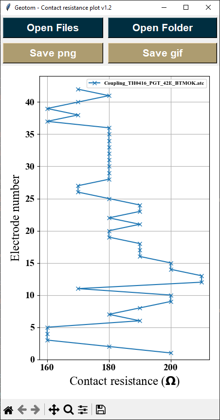

# Geotom-App Guide

## Overview
Plotting app for GeoTom E100K1 on Windows.
- This app plots contact resistance data saved from Coupling-Test function from GeoTom.
- Typical file extension is ".atc".

GeoTom is a portable ERT device that accepts up to 100 electrodes.

Electrical resistivity tomography (ERT) is a geophysical method that measures the electrical resistivity of subsurface materials in order to image the subsurface structure. 

Contact resistance (CR) test shows how good the electrical contact between electrodes and surrounding soil, lower CR indicates good contact, infinitely high CR may indicate issue of electrode connection, ground contact, wiring problem.

- Keywords: GeoTom, E100K1, GUI, contact resistance
- Developed by Ngui Yin Jeh, Jason

## Download and use
- Tested using Windows 7, 10 and 11.
- No installation required, download this [latest standalone exe](https://github.com/flyercarol/Geotom/raw/main/v1.2/geotom_app.exe) and execute it in Windows environment.
- No additional user permission is needed.

## Development and testing
Several python libraries are used to complete this Geotom-App：
- matplotlib
- pyinstaller
	- For exe packaging

# Getting started
- Click `Open Files` to plot selected files, hold `Shift` or `Control` to select multiple files
- Click `Open Folder` to plot all `.atc` files in folder instead.
- Contact resistance profile is plotted in borehole mode, with the first electrode located at the deepest depth (closest to drilled depth)
  - Multiply `Electrode number x electrode spacing` to get target depth
- To save data, you can either
  - `Save png`: for a single stacked plot as shown
  - `Save gif`: for time-lapsed profile, showing recent 6 data to illustrate changes according to time
- For best result, save files as `[BH name] [Datetime].atc` to allow sort and plot in ascending order.

## Screenshots
### Startup

### Sample stacked contact resistance profile using `Save png`

### Sample time-lapse gif file from `Save gif`

# Citing Geotom-App
Please cite this paper if you use Geotom-App for your work:

	Yin Jeh Ngui, Mihai Cimpoiasu, Will Hartas, Will Nickson, Philip Meldrum, Paul Wilkinson, Jonathan Chambers, Rachel Dearden, Michael Spence, and Oliver Kuras (2023) ‘Rapid grout level monitoring in UKGEOS boreholes using downhole electrical measurements’, in Near Surface Geoscience Conference & Exhibition 2023, Edinburgh, UK.

# Current version
[Geotom-App V1.2](https://github.com/flyercarol/Geotom/raw/main/v1.2/geotom_app.exe)
